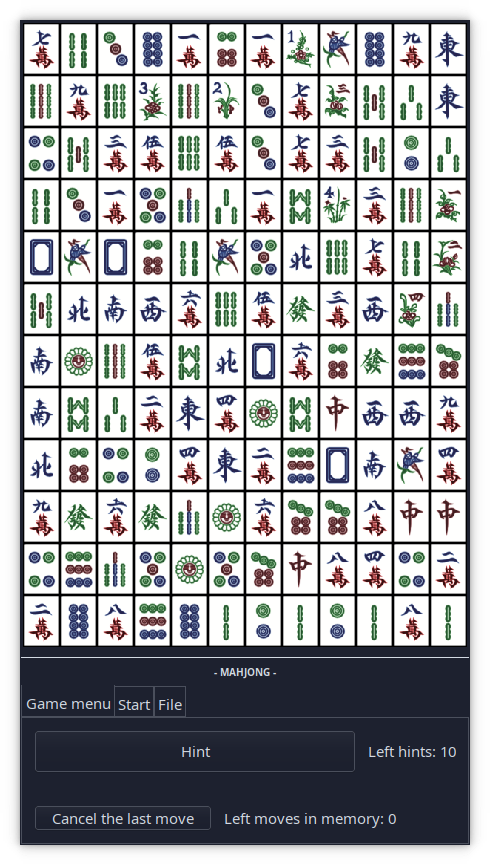

# Mahjong Game

<p align="center">
    
</p>

## Presentation

### Goal

Mahjong is a puzzle game where the player must find tile pairs. Tile pairs are valid when tiles are separated by a maximum of two *shifts*.

For instance:

```
// Valid paths
...............
..#~~~~~#...... // no shift and empty tiles
...............
...............
...............

...............
..#~~~~~+...... // one shift
........|......
........#......
...............

  +~~~~~~~~~+   // outside the board is allowed
..|.........|..
..|.........#.. // two shifts
..#............
...............
...............

// Invalid paths
...............
..#.....#~~+... // three shifts
..|........|...
..+~~~~~~~~+...
...............

...............
..#............ // no empty tiles
...............
..........#....
...............
```

Where:

- `#` represents targeted tiles
- `.` represents tiles different from targeted tiles
- ` ` (blank) are empty tiles
- `+` represents a shift
- `~` and `|` represents the path which separates targeted tiles

### Game specifications

The games has three levels of difficulty:

- Normal : puzzle is easy to solve (solution guaranteed)
- Hard: puzzle is hard to solve (solution guaranteed)
- Impossible (random) (solution not guaranteed)

The player can go back until maximum 10 steps (previous moves are kept in memory).

The player has a maximum of 10 hints during a game, where each hint gives him a valid move to play.

The player can save the game into a file and load a game from a file (files do not need specific suffix).

### Game structure

```
.
├── assets                              // assets for `README.md`
├── LICENSE
├── pom.xml                             // Maven project description
├── README.md
└── src
    ├── main
    │   └── java
    │       ├── game                    // Game files
    │       │   ├── Board.java          // Set of methods for generating a board
    │       │   ├── Game.java           // Set of methods for game rules
    │       │   ├── Solver.java         // Set of methods to solve a board
    │       │   ├── Tile.java           // Set of methods for manipulating a tile
    │       │   └── Vec2D.java          // 2D vector
    │       └── ui                      // User Interface files
    │           ├── GUI.java            // Graphical User Interface
    │           └── TUI.java            // Text User Interface
    └── test
        └── java
            └── game
                ├── TileTest.java
                └── Vec2DTest.java
```

In `game/Board.java`:

- `generateSolvableStaticLine()` is based on line methods
- `generateSolvableStatic()` generates a random solvable board. Broadly speaking, it tries to solve the board by fixing it when it is not.

In `game/Solver.java`:

- `nextMerge` finds and returns a pair of coordinates to play a valid move. This method is the core of `Solver` and it calls other methods.

In `game/Tile.java`:

- `all()` allows to generate an array of all tile types
- `number()` allows to generate a array of disponibilities by tile type

> [!NOTE]
> See [https://bourbonut.github.io/projects/mahjong/](https://bourbonut.github.io/projects/mahjong/) for more information.

> [!NOTE]
> Cheatmode is a originally a bug, which was kept and added as a feature *cheatmode*. No more spoil

## Build and run

### GUI

1. Install [Maven](https://maven.apache.org/install.html) on your machine

2. Clone the repository

```bash
git clone https://github.com/bourbonut/astar-on-maze.git
cd astar-on-maze
```

3. Run the following lines to start the GUI:

```bash
mvn package
java -cp target/mahjong-1.0-SNAPSHOT.jar ui/GUI
```

### TUI

1. Same steps `1` and `2` of `GUI`
3. Run the following lines to start the TUI:
```bash
mvn package
java -cp target/mahjong-1.0-SNAPSHOT.jar ui/TUI
```

You should see something like that:
```
      +--------------------------------+
      |     Mahjong Text Interface     |
      +--------------------------------+

Commands:
  m [l1] [c1] [l2] [c2]  Play a move between cells
                         (l1, c1) and (l2, c2)
  r [n]                  Go back n steps
  h                      Suggest a hint
  s [fileName]           Save into a file
  l [fileName]           Load a save
  ?                      Help information
  q                      Leave the program
Left tiles: 144   left hints: 10   history: 0
      01 02 03 04 05 06 07 08 09 10 11 12
   +-------------------------------------+
01 | S3 D1 R6 R3 F2 R9 S2 R1 B3 R2 R8 C6 | 01
02 | R8 C9 B4 F3 B1 R2 B7 R1 F4 S1 C4 B6 | 02
03 | V3 R7 D3 C3 B1 D1 B9 C6 C5 V3 C4 R5 | 03
04 | R9 C6 R5 R4 C8 C3 C4 D1 F1 V3 C3 B6 | 04
05 | S4 B1 C3 V1 C7 V2 C7 R3 V2 R3 B8 B1 | 05
06 | B6 R2 B5 V1 V4 B9 V3 V4 V4 R2 R7 B7 | 06
07 | B7 V4 C4 V1 C7 B7 B5 R6 B9 R6 B3 D1 | 07
08 | C2 R1 C7 R6 R7 V1 R4 R7 C8 B8 B9 V2 | 08
09 | C6 R4 C2 R5 R5 C2 R9 R3 C2 R9 B8 D3 | 09
10 | V2 C5 R1 B5 B6 D2 B5 B4 C5 C8 C8 C9 | 10
11 | D3 D2 B3 R8 R8 B8 D2 B4 C9 R4 D2 C5 | 11
12 | C9 B3 B2 C1 C1 D3 C1 B4 C1 B2 B2 B2 | 12
   +-------------------------------------+
     01 02 03 04 05 06 07 08 09 10 11 12
[l1 c1 l2 c2]>
```

> [!NOTE]
> You can quit the program in `TUI` mode by pressing `q` + `ENTER` or `CTRL+C` or `CTRL+D`
